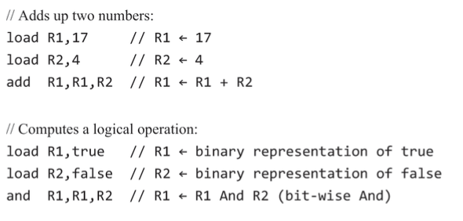
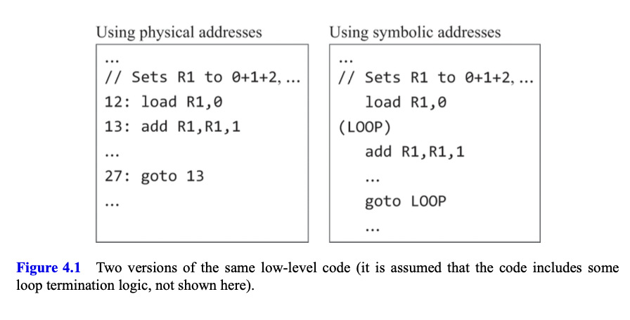

# Overview & Elements
In chapters 1-3, we've built various hardware components like **processing** and **memory chips** that can be integrated into a general-purpose computer. Before we proceed with the computer's construction, we need to define its purpose. Architect **Louis Sullivan** once said, "**Form follows function**," which means understanding the system's function is essential in its design. In our case, this chapter is dedicated to studying the **machine language** that our computer hardware platform is meant to execute efficiently.

**Machine language** is a formal system used to **encode machine instructions**. These instructions tell the computer's processor how to perform tasks like **`arithmetic, logic operations, reading/writing data from/to memory, evaluating conditions, and determining the next instruction to execute`.** Unlike high-level programming languages that focus on **cross-platform** compatibility and **expressive** power, machine languages are designed specifically for efficient execution on a **particular hardware platform**. They aim to provide control and direct interaction with the hardware.

Machine language serves as the **crucial interface where software and hardware meet**. It's the point where abstract human-designed high-level programs are translated into physical operations executed by the computer's silicon components. You can think of machine language as both a **programming tool** and an **integral part** of the computer's hardware. Just as the hardware is built to execute instructions written in a specific machine language, that machine language is **tailored to control that hardware platform**.

This chapter starts with a general introduction to low-level programming in machine language. Then, it provides a detailed specification of the **Hack machine language**, explaining both its **binary** and **symbolic** versions. The chapter concludes with a project that involves writing machine language programs. This hands-on experience in **low-level programming** is crucial for a deep understanding of **how computers work**. It also helps programmers write more efficient high-level programs. Ultimately, it's fascinating to see that even the most advanced software systems are built upon simple instructions, each specifying a basic operation performed by the underlying hardware.

# Machine Language: Overview
In this chapter, our focus shifts from the physical computer hardware to the language that commands the machine. We'll put aside the intricate details of the hardware platform and concentrate on the essential hardware components that machine language instructions directly reference and interact with.

## Hardware Elements
Machine language can be seen as a standardized system designed to work with computer memory, a processor (often referred to as the CPU), and a set of registers.

**Memory:** Memory encompasses various hardware components in a computer, collectively used to store data and instructions. Functionally, memory consists of a continuous sequence of cells, often called locations or memory registers. Each of these registers has a unique address, and you can access a specific memory register by providing its address.

**Processor (CPU):** The processor, also known as the Central Processing Unit (CPU), is a device capable of performing a **predefined set of basic operations**. These operations include **arithmetic** and **logical calculations**, **accessing memory**, and **controlling program flow** (such as branching). The processor takes inputs from selected registers and memory locations and writes its results back to designated registers and memory locations. It consists of several essential components, including an Arithmetic Logic Unit (ALU), a set of registers, and gate logic that allows it to understand and execute binary instructions.

**Registers:** Processors and memory are typically separate chips, and transferring data between them can be **relatively slow**. To overcome this limitation, processors are equipped with **on-board registers**, which are small, **high-speed storage units** located inside the processor chip. Registers come in two main types: **data registers, designed to hold data values, and address registers**, which can store values that are interpreted as either data or memory addresses. The computer's architecture is set up so that when you place a specific value, like "n," into an address register, it immediately selects the memory location corresponding to that address. This rapid selection allows for efficient subsequent operations on the chosen memory location.

## Languages
Machine language programs can be written in two different but equivalent ways: **binary** and **symbolic**.

**Binary Format:** In the binary format, machine language instructions are represented using binary codes. For example, if we want to perform the operation "set R1 to the value of R1 + R2," we might use binary codes like 101011 for addition and 00001 and 00010 for registers R1 and R2, respectively. When combined, these binary codes form a complete instruction like 1010110001000001.

In the early days of computing, programmers had to manually input these binary codes by toggling mechanical switches on the computer's hardware. Debugging such programs was extremely challenging, as it required manual entry and verification of each instruction.

**Symbolic Format:** To make programming more **convenient** and **error-free**, programmers started using symbolic codes. In this format, instructions are represented using **human-readable symbols** and **mnemonics**. For example, the symbolic format "add R2, R1" might be used to represent the operation "set R1 to the value of R1 + R2." The correspondence between symbolic instructions and binary codes is maintained through a program called an assembler, which translates symbolic instructions into executable binary code.

This innovation made programming much more manageable, as it allowed programmers to write and debug programs using symbolic instructions before translating them into binary code. **Symbolic machine languages** are often referred to as **assembly languages**, and the programs that perform the translation are called assemblers.

It's important to note that the syntax of an **assembly language** is closely tied to the specific hardware details of the target computer. Different computers may have different assembly languages due to variations in hardware components like the **Arithmetic Logic Unit** (ALU), the number and type of registers, memory size, and more. Despite these differences, all machine languages are theoretically equivalent and support similar fundamental tasks.

## Instructions
In what comes next, let's suppose that the computer's processor has a set of registers named **R0, R1, R2, and so on**. The exact number and type of these registers don't matter for our current discussion.

Arithmetic and logical operations: Every machine language includes instructions for **performing basic arithmetic operations** like **addition** and **subtraction**, as well as fundamental logical operations like **And**, **Or**, and **Not**. Here are some examples:

For these symbolic instructions to actually work on a computer, they need to be translated into **binary code**. This translation is carried out by a program called an **assembler**, which we'll create in **Chapter 6**. For now, let's assume that we have access to this assembler and can use it as needed.

### Memory access 
Every machine language provides ways to access and manipulate **specific memory locations**. This is typically accomplished using an address register, which we'll call A for simplicity.

For instance, let's say we want to set the value at memory location 17 to 1. We can achieve this using two instructions: `load A, 17`, followed by `load M, 1`. In this convention, M represents the **memory register** selected by A, which means the memory location whose address is the current value of A.

Now, imagine we want to set the values of **fifty memory locations**, ranging from 200 to 249, to 1. We can do this by executing the following sequence of instructions:

- `load A, 200` to set A to the starting memory address (200).
- Then, we can enter a loop that executes the instructions `load M, 1` and `add A, A, 1` fifty times. This loop will effectively increment the address in A with each iteration, allowing us to update consecutive memory locations.
  
### Flow control: 
In computer programs, instructions are usually executed sequentially, one after the other. However, programs often need to jump to different locations in certain **conditions** or **unconditionally**. To enable this branching behavior, machine languages include various forms of instructions for both conditional and unconditional jumps, along with label declarations that indicate where these jumps should go. Below, you can see an example of how machine language handles a basic branching action:

### Symbols: 
In the previous example (figure 4.1), both versions of the code were written in **assembly language**, but they needed to be translated into binary code before execution. Interestingly, both versions achieved the same logic. However, the version that used symbolic references was much easier to write, debug, and maintain.

What's more, unlike the code that relies on **physical memory addresses**, the binary code generated from the version with symbolic references can be loaded into and executed from any available memory segment in the computer. This kind of low-level code, which doesn't mention specific physical addresses, is called "**relocatable**." Relocatable code is crucial in modern computer systems like PCs and smartphones, where multiple applications are loaded and executed **dynamically** and **concurrently**. Therefore, symbolic references serve a purpose beyond aesthetics; they free the code from unnecessary ties to specific memory locations.

This concludes our brief introduction to some fundamental aspects of machine language. The next section provides a formal description of a specific machine language—the native code used by the **Hack computer**.

